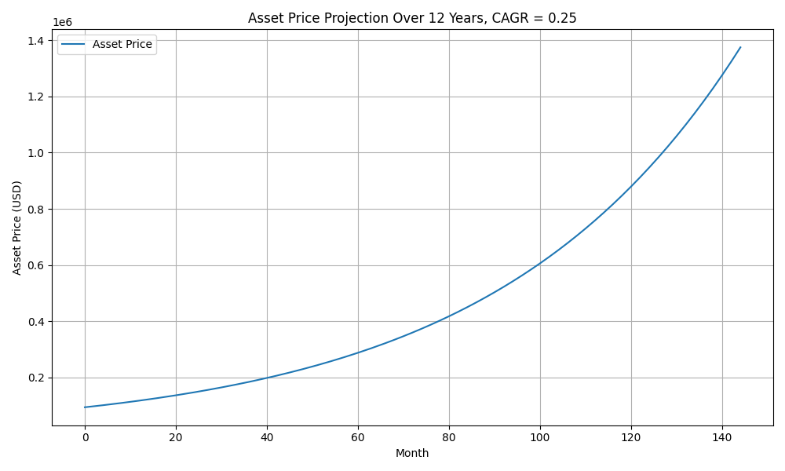
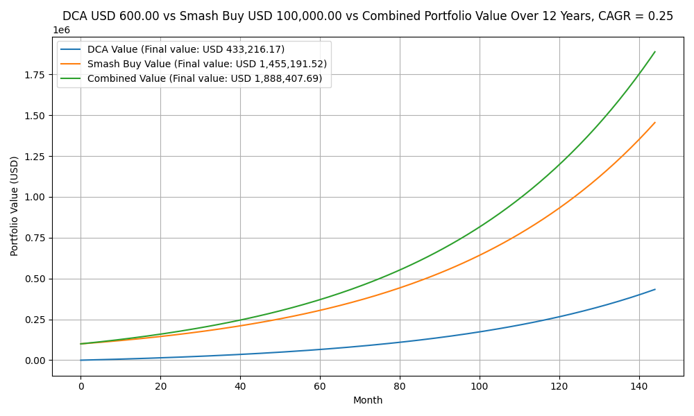
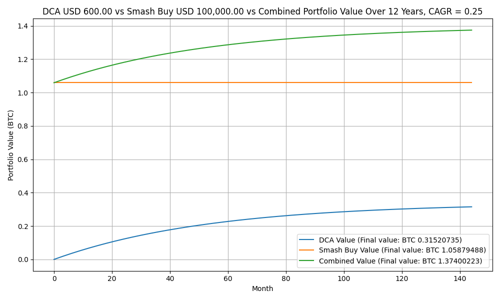
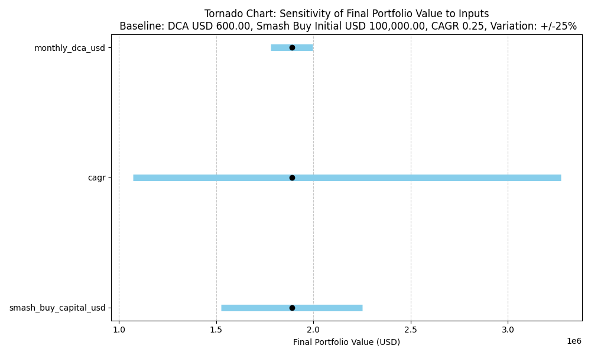

# Portfolio Analysis

*Author:* hodl-analysis 
*Date:* 2025-11-16

---

## 1. Introduction

> This analysis evaluates the projected growth of a portfolio over 12 years using a combination of smash buy and dollar-cost averaging (DCA) strategies. Sensitivity of the portfolio to key parameters is also analyzed.

---

## 2. Methodology

- **Inputs:**
  - Initial asset price: `$94,447`  
  - Smash Buy Capital: `$100,000`  
  - CAGR: `25%`  
  - Monthly DCA: `$600`  

- **Process:**
  1. Project asset price over 12 years using CAGR.
  2. Track DCA purchases monthly.
  3. Track smash buy value from initial investment.
  4. Combine DCA and smash buy to get total portfolio value.
  5. Perform sensitivity analysis ±25% for each input.
  
- **Tools:** Python, Pandas, Matplotlib

---

## 3. Results

### 3.1 Asset Price Projection

> Figure 1: Projected asset price over 12 years.

### 3.2 Portfolio Value Comparison

> Figure 2: Value of DCA portfolio, smash buy, and combined portfolio over time.

> Figure 3: Value in BTC of DCA portfolio, smash buy, and combined portfolio over time.

### 3.3 Sensitivity Analysis

> Figure 4: Tornado chart showing sensitivity of final portfolio value to ±25% changes in each input.

- **Observations:**
  - The portfolio is most sensitive to `CAGR`.  
  - Smash buy impacts early portfolio value, while DCA contributions grow steadily.  
  - Combined portfolio captures benefits of both strategies.

---

## 4. Data

- All data is available in CSV format:  
  - [Projection Data](output_value/value_projection_output_0.25_12yr.csv)  
  - [Sensitivity Analysis](output_sensitivity/sensitivity_analysis_0.25_12yr_100000_600_10.csv)

---

## 5. Conclusion

- CAGR dominates portfolio growth sensitivity.  
- Smash buy gives immediate exposure to the asset.  
- DCA provides steady accumulation and reduces timing risk.  
- Combined strategy maximizes potential value while mitigating risk.

---

## 6. References / Notes

- Source of CAGR assumption: e.g., historical BTC growth rates.  
- Assumes monthly compounding and no transaction fees.  

